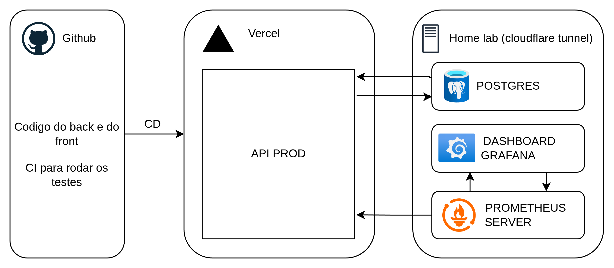

# Teste tecnico Seiwa

[](https://github.com/fenol64/teste-tecnico-seiwa/actions/workflows/ci-cd.yml)

Este repositório contém o código-fonte para o teste técnico da Seiwa, incluindo a implementação de uma API RESTful para gerenciamento de repasses financeiros.

projeto foi desenvolvido utilizando Python com FastAPI, PostgreSQL como banco de dados, e Docker para containerização. Além disso, foram integradas ferramentas de monitoramento como Prometheus e Grafana.

**Fique a vontade para testar a API via Swagger UI ou o frontend desenvolvido em React Native disponível neste repositório.**

Swagger: https://api-seiwa.fenol64.com.br/docs
App: https://test-tec-seiwa.fenol64.com.br/

Repositório do Frontend:
https://github.com/fenol64/teste-tecnico-seiwa-frontend

**usuário ja com dados poupulados pela seed**

email: admin@seiwa.com <br>
senha: 123456

### Contexto

A Seiwa integra dados financeiros de médicos a partir de sistemas hospitalares distintos. Um dos desafios é consolidar eventos financeiros, garantir consistência, performance e auditabilidade.

### Desafio

Você deverá desenvolver uma API para consolidar repasses e informações financeiras de médicos. A API deve permitir:

- Cadastrar médicos
- Registrar produções (valor, data, hospital)
- Registrar repasses (valor, data, hospital)
- Consultar saldo consolidado de um médico por período

Fique a vontade para usar uma linguagem/framework de sua escolha, bem como para complementar a entrega com documentos e informações adicionais, se julgar necessário. A ideia é que você faça um projeto de forma bem "livre", até porque não é só sua capacidade de desenvolvimento que queremos avaliar, fechado?

## Tecnologias Utilizadas
- Python 3.11
- FastAPI
- PostgreSQL
- SQLAlchemy
- Alembic
- Docker & Docker Compose
- Prometheus & Grafana para monitoramento
- Pytest para testes automatizados

##  Arquitetura macro



## Decisões de Projeto

- **Clean Architecture**: Para garantir separação de responsabilidades e facilitar a manutenção.
- **FastAPI**: Escolhida pela sua performance e velocidade de desenvolvimento.
- **SQLAlchemy + Alembic**: Para facilitar o mapeamento objeto-relacional e migrations.
- **Docker**: Para garantir que o ambiente de desenvolvimento seja consistente e fácil de configurar.
- **Pytest**: Para garantir a qualidade do código através de testes automatizados (unitários e de integração).
- **Prometheus & Grafana**: Para monitoramento e visualização de métricas da aplicação.

## pastas Importantes

- `api/`: Definição do WSGI para deploy na vercel
- `alembic/`: Migrations do banco de dados
- `docs/`: Documentação do projeto e arquivos auxiliares para IA pegar contexto
- `scripts/`: Scripts auxiliares como seeders
- `src/`: Código-fonte da aplicação
  - `bootstrap/`:  injeção de dependências e overrides
  - `controllers/`: handlers das rotas da API
  - `routes/`: Definição das rotas da API
  - `services/`: Serviços da aplicação
  - `domain/`: Entidades e regras de negócio
    - `application/`: Casos de uso e lógica de negócio
    - `infrastructure/`: Implementações específicas (banco de dados, etc)
    - `interfaces/`: Definições de interfaces e contratos
- `tests/`: Testes automatizados
- `ops/`: Configurações de infraestrutura (Docker, Prometheus, Grafana, etc)

## Como Rodar o Projeto

### Pré-requisitos
- Docker e Docker Compose instalados na sua máquina.
### Passos
1. Clone o repositório:
   ```bash
   git clone https://github.com/fenol64/teste-tec-seiwa.git
   ```
2. Navegue até o diretório do projeto:
   ```bash
   cd teste-tec-seiwa
   ```
3. Inicie os serviços com Docker Compose:
   ```bash
   make up
   ```
4. Acesse a API em `http://localhost:8000`. A documentação interativa estará disponível em `http://localhost:8000/docs`.

## Endpoints para o Teste Técnico

- **Médicos**
  - `POST /medicos/`: Cadastrar um novo médico.
  - `GET /medicos/{medico_id}/`: Obter detalhes de um médico.
- **Produções**
    - `POST /producoes/`: Registrar uma nova produção.
    - `GET /producoes/{medico_id}/`: Listar produções de um médico.
- **Repasses**
    - `POST /repasses/`: Registrar um novo repasse.
    - `GET /repasses/{medico_id}/`: Listar repasses de um médico.
- **Saldo Consolidado**
    - `GET /medicos/{medico_id}/saldo/?data_inicio=&data_fim=`: Consultar saldo consolidado de um médico em um período.

## Testes
Para rodar os testes automatizados, execute:
```bash
make test
```

## CI/CD

O projeto possui pipeline automatizado de CI/CD usando GitHub Actions:

- ✅ **Testes automáticos** em cada push e pull request
- 🚀 **Deploy automático** para Vercel (apenas após testes passarem)
- 📊 **Cobertura de código** com relatórios automáticos

**O deploy só acontece se todos os testes passarem!**

Para mais detalhes, veja [.github/CI-CD.md](.github/CI-CD.md).

## Monitoramento

O projeto inclui stack completa de monitoramento:

- **Prometheus** (http://localhost:9090): Coleta de métricas
- **Grafana** (http://localhost:3000): Dashboards e visualizações
  - Usuário: `admin`
  - Senha: `admin`

Para acessar:
```bash
make prometheus  # Abre Prometheus
make grafana     # Abre Grafana
```

Veja [MONITORING.md](MONITORING.md) para mais detalhes.


